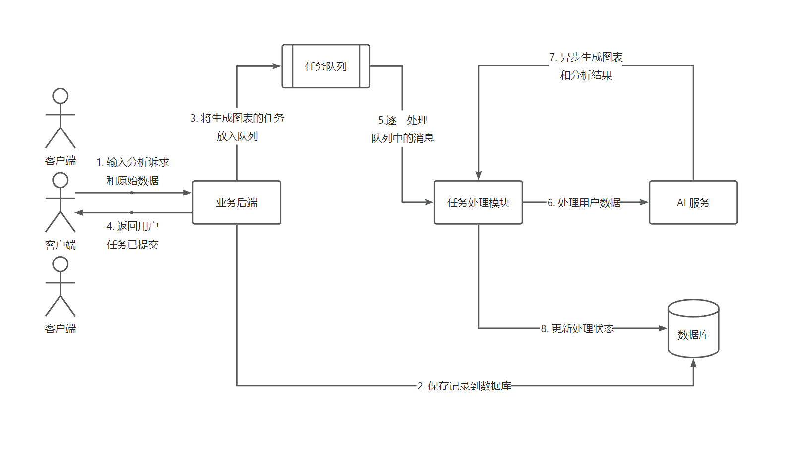
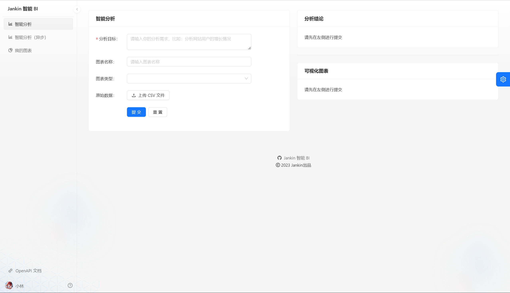
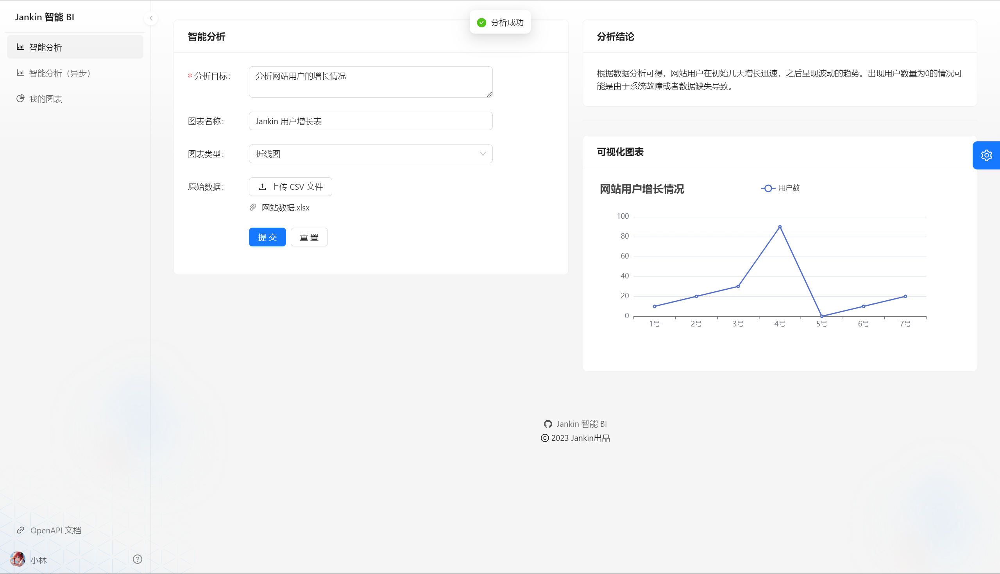
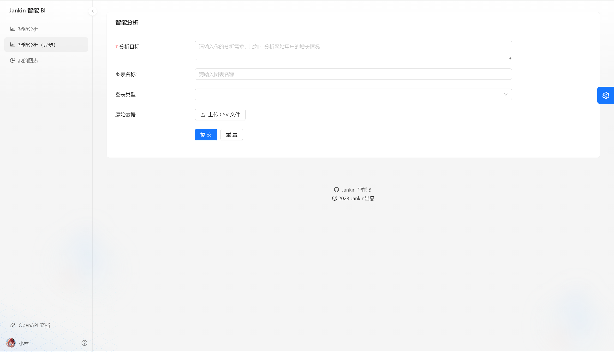
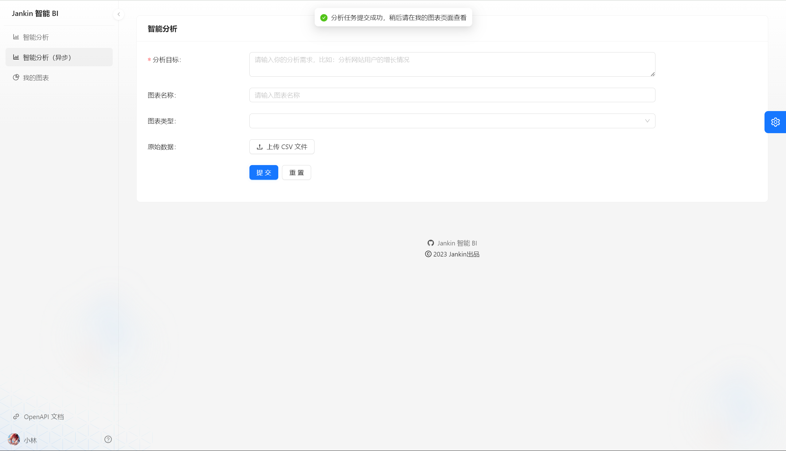
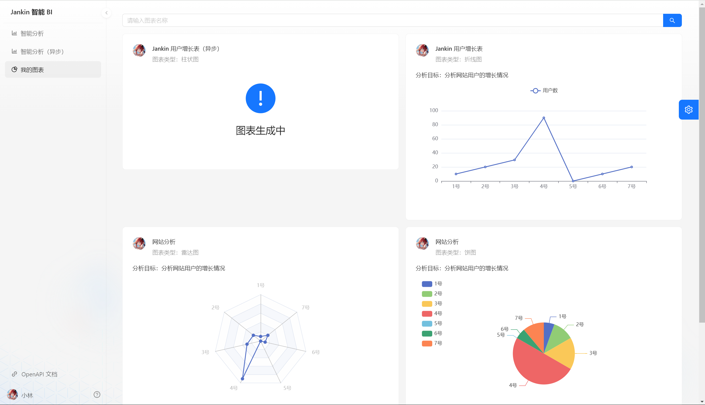
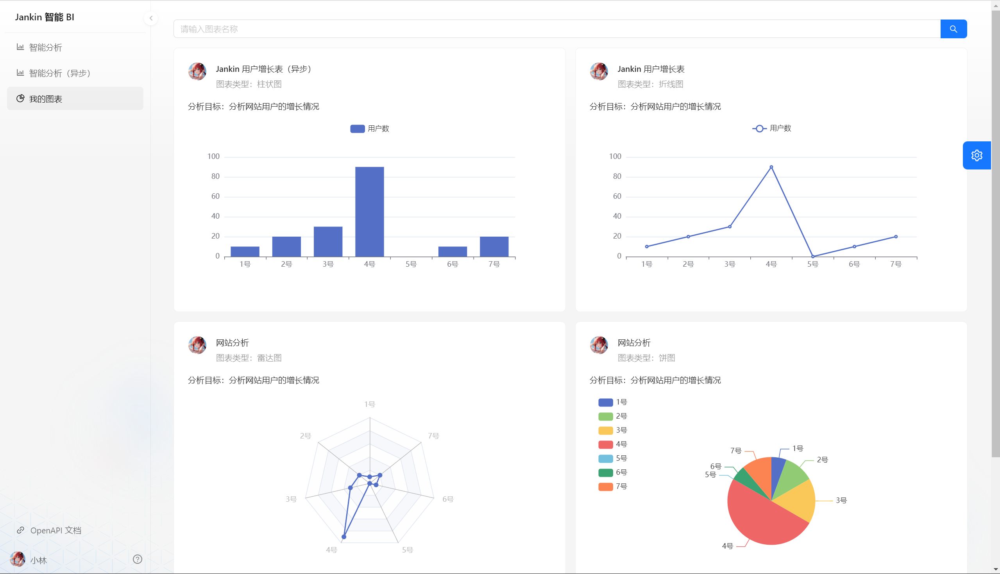
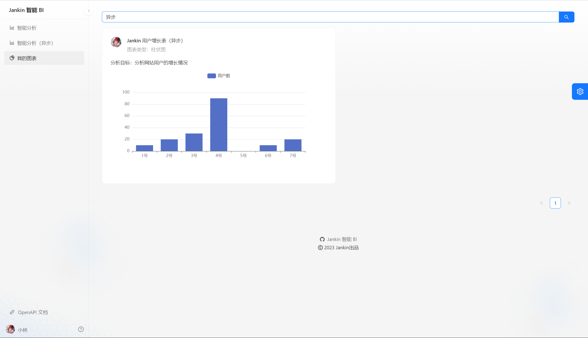
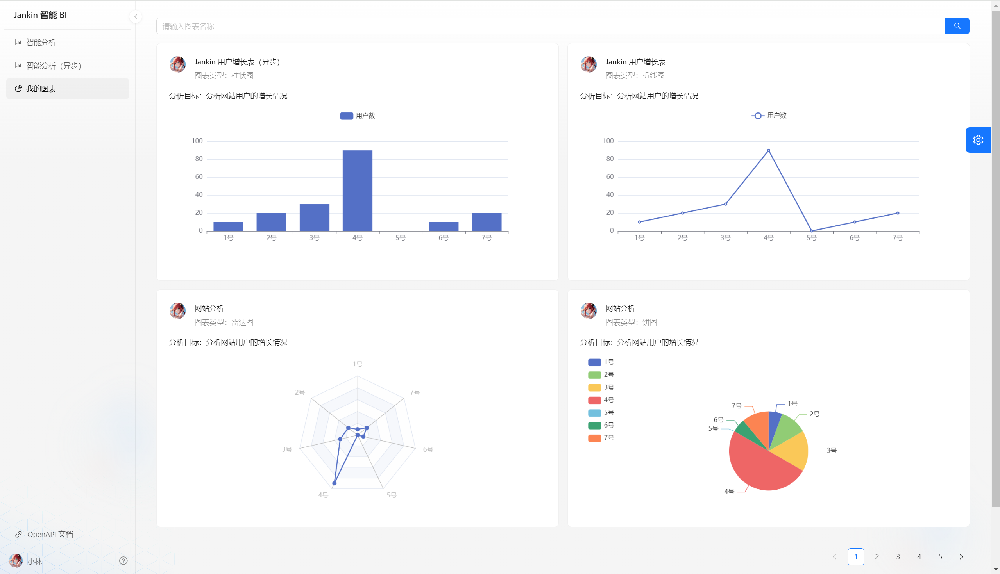

# Jankin-BI
> 基于 Spring Boot + MQ + AIGC + React 的智能数据分析平台。区别于传统 BI，用户只需要导入原始数据集、并输入分析诉求，就能自动生成可视化图表及分析结论，实现数据分析的降本增效。

### 架构图

### 技术选型

##### 前端：

- React
- Umi + Ant Design Pro 开发框架
- Echarts 可视化开发库
- umi openapi 代码生成（自动生成后端调用代码）

##### 后端：

- Spring Boot
- MySQL 数据库
- MyBatis Plus 数据访问框架
- RabbitMQ（消息队列）
- AI 能力（第三方 AI 接口）
- Easy Excel（Excel 的上传和数据的解析）
- Swagger + Knife4j 项目接口文档
- Hutool 工具库

### 启动方式

1. 启动 MySQL、Redis、RabbitMQ
2. 启动后端：jankin-bi-backend：8080 端口，后端接口管理 http://localhost:8080/api/doc.html
3. 启动前端：jankin-bi-frontend （npm run start:dev）

### 项目展示

- 智能分析

----

----

- 智能分析（异步）

----

----

- 我的图表

----

----

### 设计文档

>  见 `jankin-bi-backend/doc` 目录下